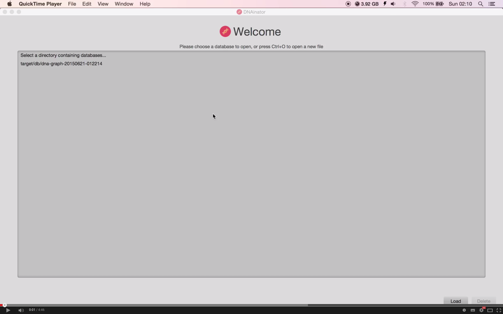
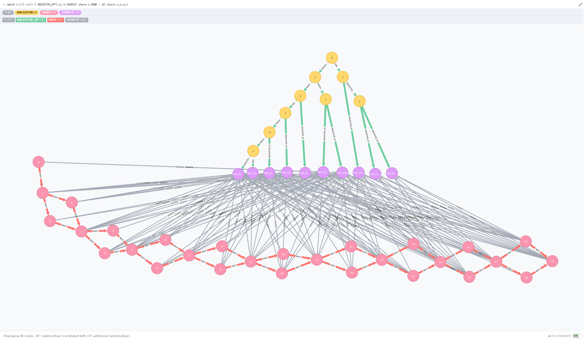

# DNAinator 

## Contributors

Group ID: PL4

| Name             | Student Number | E-mail                    |
|------------------|----------------|---------------------------|
| Jente Hidskes    | 4335732        | hjdskes@gmail.com         |
| Gerlof Fokkema   | 4257286        | gerlof.fokkema@gmail.com  |
| Owen Huang       | 4317459        | 0w3nhuang@gmail.com       |
| Skip Lentz       | 4334051        | skip_meesie@hotmail.com   |
| Piet van Agtmaal | 4321278        | pietvan8maal@hotmail.com  |

Our contribution to this project will end now.

Below you will find a link to the video of the final result.

Our application relies heavily on Neo4j and the [property graph model](https://github.com/tinkerpop/blueprints/wiki/Property-Graph-Model) it adheres to.
The image below illustrates this fact, and gives a quite clear impression of how our data is stored.

